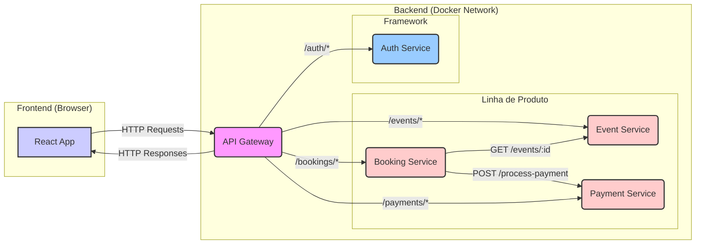

# Sistema de Gestão de Eventos (Microsserviços) 🚀

Este projeto demonstra a criação de um Sistema de Gestão de Eventos utilizando uma arquitetura de microsserviços, desenvolvido como parte das disciplinas de "Reuso de Software e Metodologias Ágeis" e "Tópicos em Engenharia de Software - Projetando Linhas de Produção de Software".

O sistema implementa:

1.  Um **Framework Reutilizável** (Core Assets) composto por um API Gateway e um Serviço de Autenticação/Autorização com papéis.
2.  Uma **Linha de Produto de Software (SPL)** para Gestão de Eventos, construída sobre o framework, com funcionalidades de cadastro de eventos (pagos/gratuitos), inscrições e simulação de pagamentos.

## ✨ Arquitetura

O sistema segue uma arquitetura baseada em microsserviços orquestrados via Docker Compose:

* **Frontend (React + TypeScript):** Interface do usuário que consome a API.
* **API Gateway (Node.js + Express):** Ponto único de entrada (`SPOE`), responsável por rotear as requisições para os microsserviços apropriados.
* **Microsserviços (Node.js + TypeScript + Express):**
    * `auth-service` (Framework): Gerencia usuários, autenticação (JWT) e papéis ('creator', 'attendee').
    * `event-service` (SPL): Gerencia o CRUD de eventos, incluindo informações sobre gratuidade/preço e controle de acesso básico.
    * `booking-service` (SPL): Gerencia inscrições em eventos, verifica se o evento é pago (consultando `event-service`) e chama o `payment-service` se necessário. Armazena o status da inscrição.
    * `payment-service` (SPL): Simula o processamento de pagamentos.

### Diagrama da Arquitetura


## 🔧 Tecnologias Utilizadas
* **Frontend: React, TypeScript, Vite, Axios, jwt-decode, CSS-in-JS**
* **Backend: Node.js, TypeScript, Express, express-http-proxy, jsonwebtoken, bcryptjs, axios**
* **Infraestrutura/Ferramentas: Docker, Docker Compose, Git, VS Code**

## ⚙️ Pré-requisitos
Antes de começar, garanta que você tenha instalado:
* **Node.js (versão LTS recomendada)**
* **Docker Desktop**
* **Git**

## 🚀 Como Executar Localmente

1.  **Clone o Repositório:**
    ```bash
    git clone [https://github.com/antoinec8/sistema_de_gestao_de_eventos.git](https://github.com/antoinec8/sistema_de_gestao_de_eventos.git)
    cd sistema_de_gestao_de_eventos
    ```

2.  **Inicie o Docker Desktop:** Abra o aplicativo Docker Desktop e aguarde ele iniciar completamente (ícone da baleia estável).

3.  **Execute o Backend (Microsserviços):**
    Abra um terminal na pasta raiz do projeto (`sistema_de_gestao_de_eventos`) e execute:
    ```bash
    docker compose up --build
    ```
    *(Na primeira vez, o `--build` é necessário. Nas próximas, `docker compose up` é suficiente).*
    * Aguarde até que todos os 5 serviços (`api-gateway`, `auth-service`, `event-service`, `booking-service`, `payment-service`) mostrem a mensagem "rodando na porta...".

4.  **Execute o Frontend:**
    * Abra **outro** terminal.
    * Navegue até a pasta do frontend:
        ```bash
        cd frontend
        ```
    * Instale as dependências (apenas na primeira vez):
        ```bash
        npm install
        ```
    * Inicie o servidor de desenvolvimento:
        ```bash
        npm run dev
        ```

5.  **Acesse a Aplicação:** Abra seu navegador e acesse `http://localhost:5173`.

## 📂 Estrutura do Projeto
/sistema-eventos

├── /api-gateway           # Microsserviço: Ponto de entrada (Framework)

├── /frontend              # Aplicação React (Cliente)

├── /services

│   ├── /auth-service      # Microsserviço: Autenticação/Usuários (Framework)

│   ├── /booking-service   # Microsserviço: Inscrições (SPL)

│   ├── /event-service     # Microsserviço: Eventos (SPL)

│   └── /payment-service   # Microsserviço: Pagamentos (SPL)

├── docker-compose.yml     # Orquestrador dos containers Docker

├── .gitignore             # Arquivos ignorados pelo Git

└── README.md              # Este arquivo

## ✅ Funcionalidades Implementadas

* Registro de usuários com papéis ('participante' ou 'criador de eventos').
* Login de usuários (verificando o papel selecionado).
* Autenticação baseada em Token JWT.
* Criação de eventos (apenas por 'criadores'), podendo ser pagos ou gratuitos.
* Listagem de eventos (mostrando preço ou gratuidade).
* Exclusão de eventos (apenas pelo dono ou por 'criadores').
* Inscrição em eventos (apenas por 'participantes').
    * Confirmação de preço para eventos pagos.
    * Chamada simulada ao serviço de pagamento para eventos pagos.
    * Atualização do status da inscrição (confirmado, pendente, falhou).
* Listagem das inscrições do usuário logado, mostrando o nome do evento e o status.
* Feedback visual para eventos excluídos na lista de inscrições.
* Interface do usuário com React e tema escuro.

## 🔮 Próximos Passos / Melhorias Futuras

* Implementar o `notification-service` para envio de e-mails.
* Substituir os arrays em memória por um banco de dados real (ex: PostgreSQL).
* Adicionar mais detalhes aos eventos (data, hora, descrição, categorias).
* Implementar funcionalidade de busca/filtragem de eventos.
* Refinar a interface do usuário.
* Adicionar testes automatizados.
---
